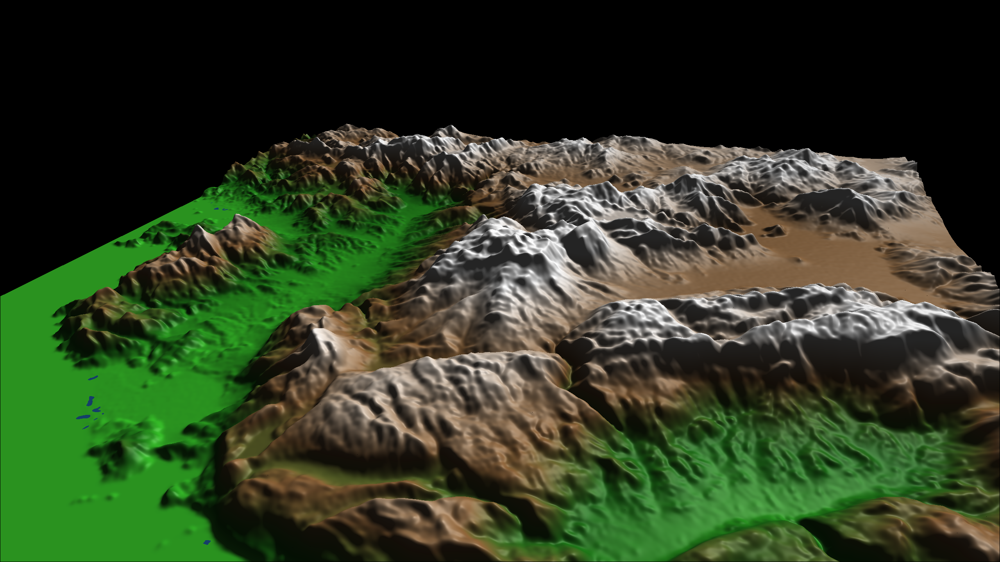
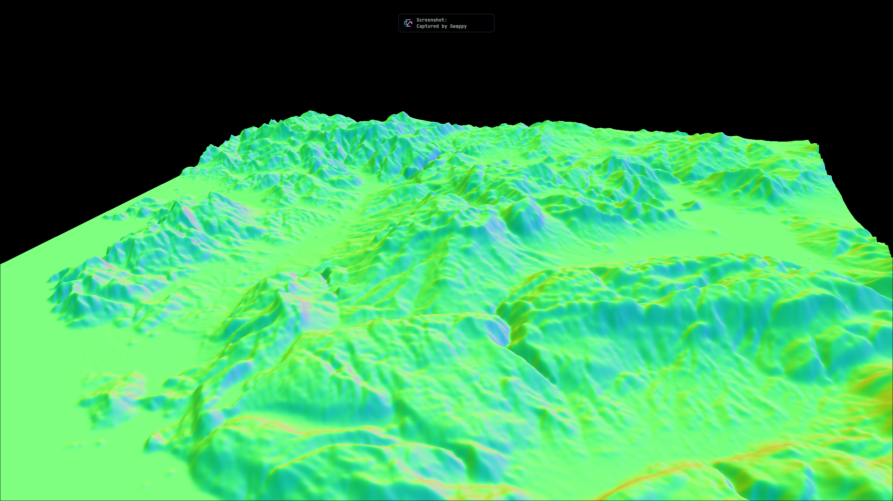
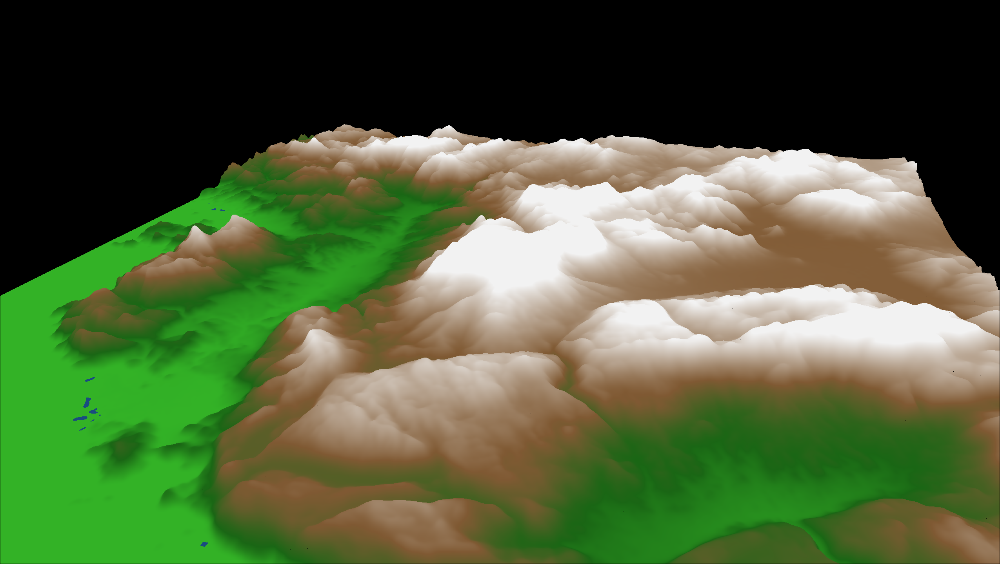
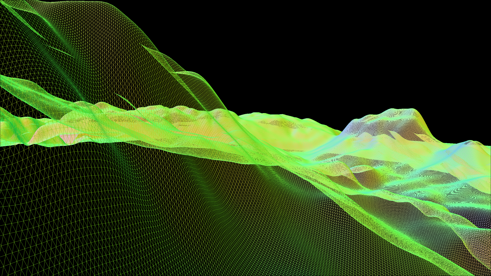
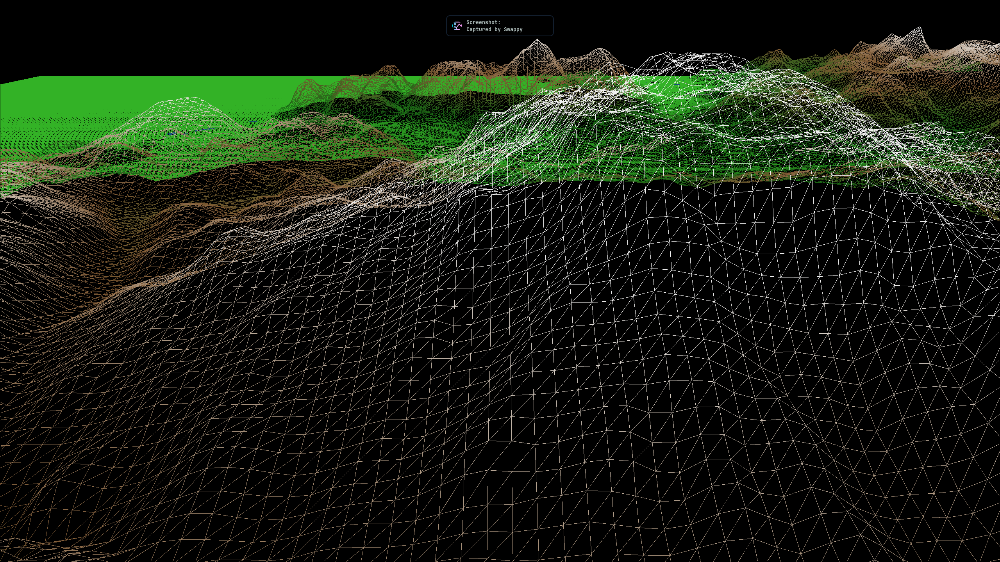
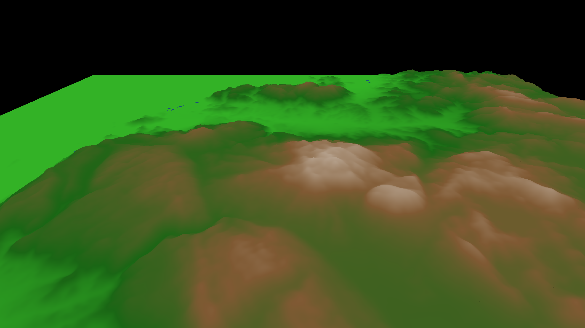
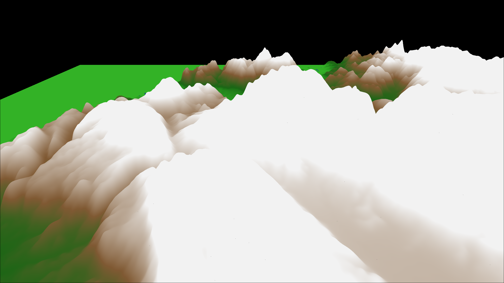
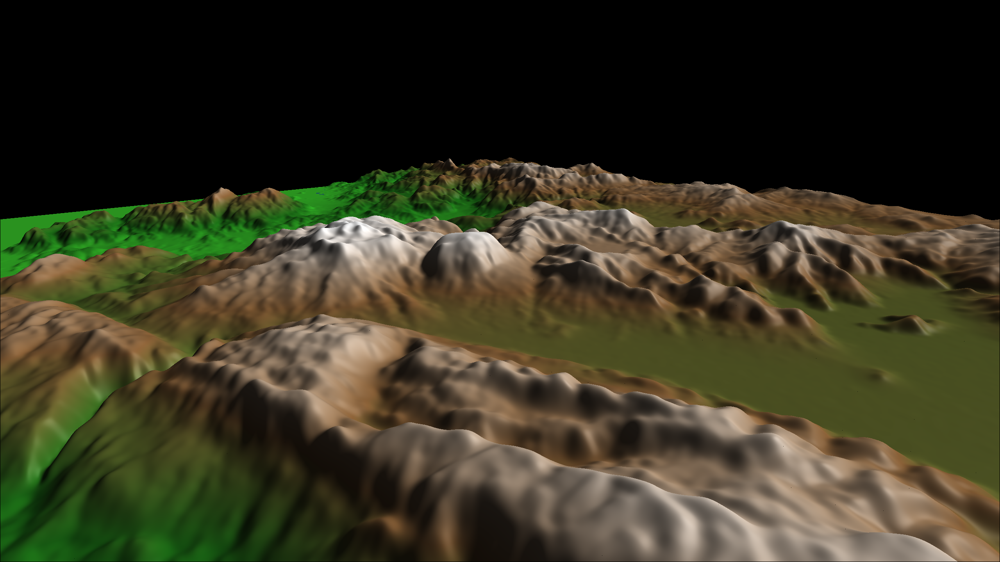

# CENG469 HW1 — Surface Rendering


## Overview

In this assignment, I implemented a terrain renderer that reads DTED elevation data, fits cubic B-spline surfaces to it, and renders the terrain with OpenGL. The program supports multiple rendering modes, a quaternion-based fly-through camera, and adjustable tessellation.


*Shaded rendering of the Dalaman-Fethiye region.*

## Implementation Steps

### 1. Loading DTED and Building a Raw Grid

My first step was to get something visible on screen. I used the provided `GeoDataDTED` class to load the elevation file, downsampled the 3601x3601 grid by taking every 10th point, and created a simple grid mesh with Y as the height value. I followed the same VAO/VBO/IBO upload pattern from the starter code's `MeshGL` class. This gave me a rough terrain with flat normals which is not looking well, but it confirmed the data pipeline worked.

### 2. Cubic B-Spline Surface Evaluation

The core of the assignment. The DTED height values become control points for cubic B-spline patches. For a grid of N x N control points, there are (N-3) x (N-3) patches, since each patch uses a 4x4 window of control points.

For each patch, the surface point at parameter (s, t) is computed as:

```
Q(s,t) = S * M * P * M^T * T^T
```

Where:
- `S = [s^3, s^2, s, 1]` and `T = [t^3, t^2, t, 1]`
- `M` is the cubic B-spline basis matrix: `(1/6) * [-1 3 -3 1; 3 -6 3 0; -3 0 3 0; 1 4 1 0]`
- `P` is the 4x4 subgrid of control point values

This is evaluated separately for X, Y (height), and Z coordinates. I precompute `M * P * M^T` once per patch to avoid redundant matrix multiplications inside the sample loop.

### 3. Analytical Normals from B-Spline Derivatives

Normals are computed analytically using the partial derivatives of the surface equation:

```
dQ/ds = dS * M * P * M^T * T     where dS = [3s^2, 2s, 1, 0]
dQ/dt = S  * M * P * M^T * dT    where dT = [3t^2, 2t, 1, 0]

normal = normalize(cross(dQ/ds, dQ/dt))
```

This gives smooth, accurate normals that follow the B-spline surface curvature, unlike finite-difference normals which would depend on the tessellation resolution.


*Surface normals visualization — RGB maps to XYZ directions, remapped from [-1,1] to [0,1].*

### 4. Quaternion Camera

The camera orientation is stored as a quaternion (`glm::quat`). Mouse input applies yaw and pitch rotations, Q/E keys apply roll. Direction vectors (forward, right, up) are derived by rotating basis vectors with the quaternion. The view matrix is built from the conjugate of the orientation quaternion combined with the camera position.

```cpp
glm::mat4 ViewMatrix() const {
    glm::mat4 rotation = glm::mat4_cast(glm::conjugate(orientation));
    glm::mat4 translation = glm::translate(glm::identity<glm::mat4>(), -pos);
    return rotation * translation;
}

void Yaw(float angle)   { orientation = glm::angleAxis(angle, Up()) * orientation; }
void Pitch(float angle) { orientation = glm::angleAxis(angle, Right()) * orientation; }
void Roll(float angle)  { orientation = glm::angleAxis(angle, Forward()) * orientation; }
```

Movement (WASD) is frame rate independent using delta time. Mouse rotation is only active while the left mouse button is held.

### 5. Rendering Modes

Three rendering modes, cycled with O/P keys:

| Mode | Description |
|------|-------------|
| Shaded | Blinn-Phong lighting with directional light and height-based albedo |
| Albedo | Height-based colors only — no lighting |
| Normals | World-space normals mapped to RGB |

 |  | 
:---:|:---:|:---:
*Shaded* | *Albedo* | *Normals*

### 6. Height-Based Albedo

The fragment shader maps vertex height to terrain colors using `mix()` for smooth transitions:

| Height Range | Color |
|-------------|-------|
| Below 0 | Water (blue) |
| 0 - 3 | Bright green to dark green |
| 3 - 10 | Dark green to brown |
| 10 - 20 | Brown to white |
| Above 20 | White (snow) |


*Albedo rendering showing height-based color transitions.*

### 7. Tessellation and Wireframe (J/K/L Keys)

The tessellation rate controls how many sample points are evaluated per patch. Pressing J decreases it (minimum 2), K increases it (maximum 30). Each change triggers a full CPU regeneration of the mesh and re-upload to the GPU, which causes a brief freeze but this is expected behavior.

Wireframe is toggled with L key using `glPolygonMode(GL_FRONT_AND_BACK, GL_LINE)`.

 | 
:---:|:---:
*Wireframe — default tessellation* | *Wireframe — low tessellation (after pressing J)*

### 8. Height Scale (U/I Keys)

Height scaling is done entirely in the vertex shader — no CPU recomputation needed. The normal matrix is adjusted with the inverse transpose of the scale to keep normals correct:

```cpp
// CPU side: normal matrix correction
glm::mat3x3 normalMatrix = glm::mat3x3(
    1.0f, 0.0f, 0.0f,
    0.0f, 1.0f / heightScale, 0.0f,
    0.0f, 0.0f, 1.0f
);
```

 | 
:---:|:---:
*Default height scale* | *Increased height scale*

## Difficulties and Design Choices

### B-Spline Basis Matrix in GLM (Column-Major)

The trickiest part was getting the B-spline basis matrix right in GLM. The mathematical matrix is written row-major, but GLM stores matrices column-major. So when constructing `glm::mat4`, each `glm::vec4` argument is a **column**, not a row. Getting this wrong produces a surface that looks plausible but is subtly incorrect.

### Control Point Grid Layout

For the 4x4 control point subgrid, I store `P[c][r]` (column-major for GLM) where `r` is the row and `c` is the column. This matches how GLM accesses `mat4[column][row]`.

### Height Scaling and Normals

When the user changes the height scale with U/I, it's a non-uniform scale `(1, h, 1)`. The normals must be transformed by the inverse transpose of this scale, which is `(1, 1/h, 1)`. Without this correction, normals would be wrong after height adjustment.

### Keybind Change

Since I don't have a numpad, I remapped NUMPAD +/- to U/I keys for height scale adjustment.

## Controls Summary

| Key | Action |
|-----|--------|
| W/A/S/D | Move forward/left/backward/right |
| Left Mouse + Drag | Yaw (horizontal) and Pitch (vertical) |
| Q/E | Roll left/right |
| J/K | Decrease/increase tessellation |
| L | Toggle wireframe |
| O/P | Cycle rendering modes |
| U/I | Decrease/increase height scale |
| ENTER | Toggle fullscreen |

## Conclusion

This assignment was a good exercise in connecting mathematical surface theory to practical GPU rendering. The B-spline evaluation and analytical normals were the most challenging parts — getting the matrix layout correct in GLM required careful attention. The quaternion camera was straightforward once I understood that rotations are applied by multiplying quaternions in the right order. Overall, seeing the smooth terrain emerge from raw elevation data was satisfying.


*Final terrain rendering with Phong shading.*
